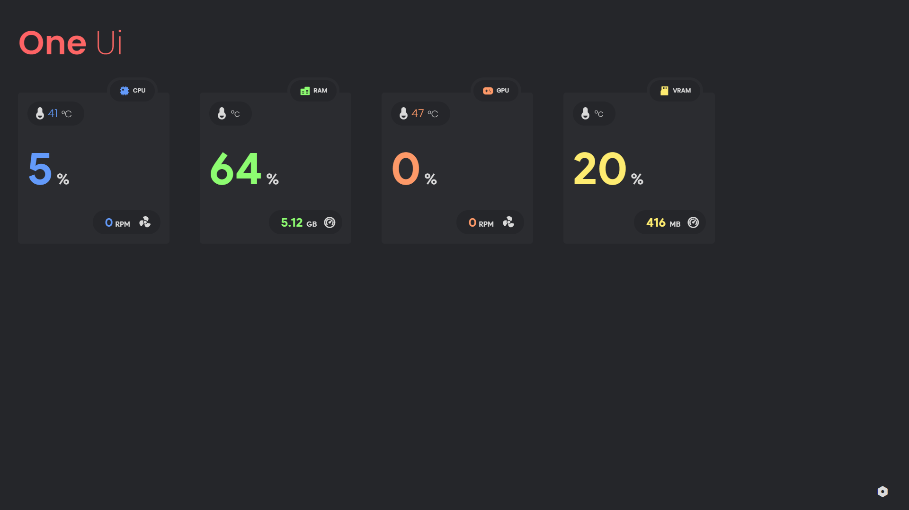
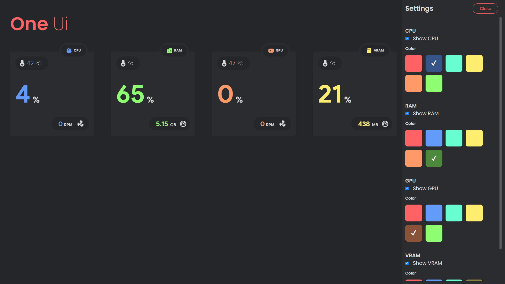
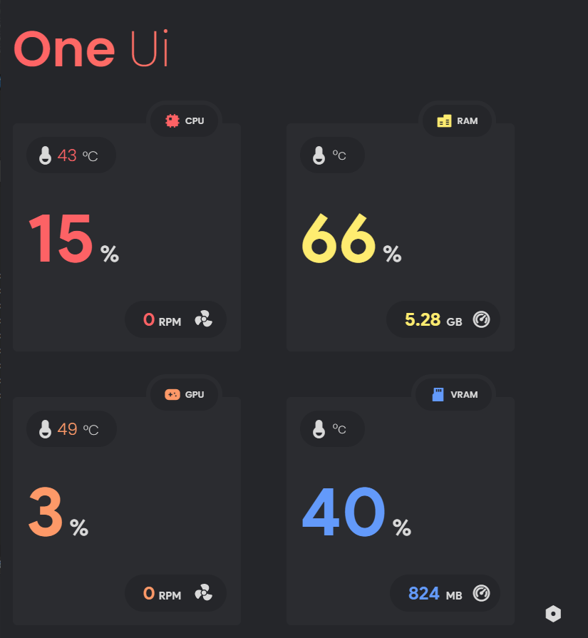

## Mobros Legacy One Ui theme

### How to use theme ?

Download Latest Release from latest tags of repo.
Unpack the zip and paste that into below path.

> C:\Users\\[UserName]\AppData\Local\MoBro_Local\public\theme\\[Here]

### Mobros : [Github](https://github.com/ModBros) [Website](https://www.mod-bros.com/)
